### A whole new world of Coda with a hint of Aria and Bolt. Adds 42 new Characters to Crypt of the Necrodancer offering wacky gameplay twists and challenges. In collaboration with Sebseb2222#6463. Banner by Ataraxia#7714.

| Description                                        | Aria-Like                                              | Coda-Like                                      | Bolt-Like                                        |
|----------------------------------------------------|--------------------------------------------------------|------------------------------------------------|--------------------------------------------------|
| Weak Dagger. Reflect incoming attacks!             | Aristo              | Crysda      | Barista   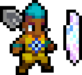   |
| Crush enemies obstructing your path!               | Pushria            | Shoveda    | Bush   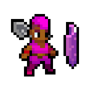         |
| No Attack. Only Throw.                             | Arigato            | Throwda    | Throlt   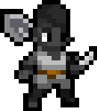     |
| Use spells only to defeat enemies!                 | Ariacadabra    | Spellda    | Wizolt   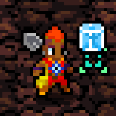     |
| Lunging & Knockback.                               | Lara                  | Lynda        | Jumpolt   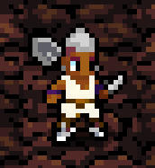   |
| You are bloodthirsty! Declare war on your enemies! | Waria                | Warda        | Boltar   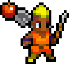     |
| No Dagger & Instant Bombs                          | Boomia              | Bombda      | Bombolt   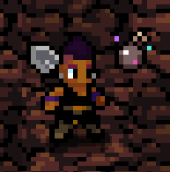   |
| Weak Dagger & Infinite Dash                        | Aridash            | Codash      | Boltash   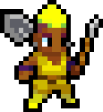   |
| No Dagger. Only Rifle.                             | Arifla              | Gunda        | Colt   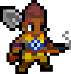         |
| Move diagonally!                                   | Ariamond          | Codiago    | Diabolt   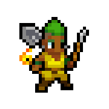   |
| Steal your enemies soul!                           | Reapia              | Soulda      | Soult   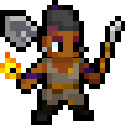       |
| You cannot see anything at all!                    | Ariblind          | Blinda      | Blindolt   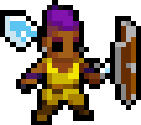 |
| Courage by heart!                                  | Ariage   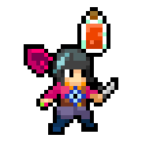           | Courda   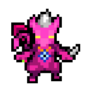   | Bold   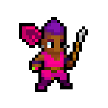         |
| Practice individual parts of Coda!                 | Fastria            | Slowda      | Bonk            |