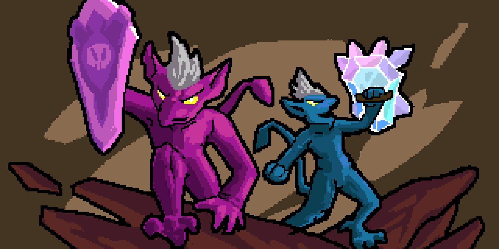

# Coda Flavors
A whole new world of Coda with a hint of Aria. Adds 20 new Characters to Crypt of the Necrodancer offering wacky gameplay twists and challenges. In collaboration with Sebseb2222#6463. Banner by Ataraxia#7714.
 

| Description                                        | Aria-Like                                        | Coda-Like                                |
|----------------------------------------------------|--------------------------------------------------|------------------------------------------|
| Weak Dagger. Reflect incoming attacks!             | Aristo            | Crysda    |
| Crush enemies obstructing your path!               | Pushria          | Shoveda  |
| No Attack. Only Throw.                             | Arigato          | Throwda  |
| Use spells only to defeat enemies!                 | Ariacadabra  | Spellda  |
| Lunging & Knockback.                               | Lara                | Lynda      |
| You are bloodthirsty! Declare war on your enemies! | Waria              | Warda      |
| No Dagger & Instant Bombs                          | Boomia            | Bombda    |
| Weak Dagger & Infinite Dash                        | Aridash          | Codash    |
| No Dagger. Only Rifle.                             | Arifla            | Gunda      |
| Move diagonally!                                   | Ariamond        | Codiago  |